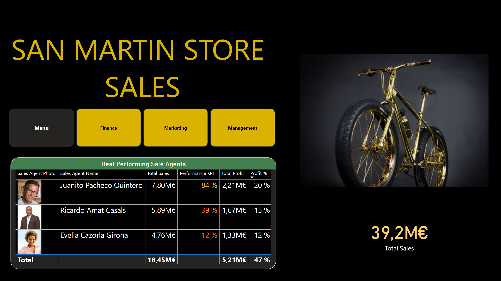

# Bike Store Sales Analysis Dashboard

## Dashboard Overview

### Finance Dashboard

### Management Dashboard

### Marketing Dashboard

### Menu

---

## Project Overview

This project demonstrates the use of **Business Intelligence (BI)** techniques to analyze the sales data of the San Martin Bike Store. The goal of the project is to provide insights to the executive board of the company for strategic decision-making using **Power BI**. The project includes data preparation, modeling, and dashboard creation to deliver key performance indicators (KPIs) and sales analysis across various dimensions like customers, products, stores, and sales agents.

---

# Project Context

The dataset for this project comes from an outdated challenge sponsored by **FP20 Analytics**. It represents one month of sales through San Martin Stores, which operate in various locations across Spain. The challenge focused on analyzing short-term sales trends without the benefit of long-term data, making the analysis more challenging and focused on immediate insights.

### Dataset Source
- **FP20 Analytics**: The dataset was sourced from a challenge hosted by FP20 Analytics, an organization that provides real-world datasets for analytics competitions and learning purposes.
  - Link to the Datasets: [FP20 Analytics Datasets](https://fp20analytics.com/datasets/)
  - Link to the FP20 Analytics LinkedIn Group: [FP20 Analytics LinkedIn Group](https://www.linkedin.com/groups/12751070/)

### Dataset Overview
The provided dataset includes structured data with a **fact table** (sales transactions) and multiple **dimension tables** (such as customers, products, locations, and sales agents). However, the dataset also contains a few errors and missing information, making data cleaning and modeling essential parts of the project. The dataset relating only **one month of sales**, the scope is limited to short-term analysis, but it remains very interesting with many dimension tables useful for analysis.

---

## Features & Functionality

- **Executive Dashboards**: 
  - **Finance**: Evaluate total sales, profit, and costs, providing an overview of financial performance.
  - **Marketing**: Analyze customer behavior, sales trends, and product performance, identifying high-potential products and markets.
  - **Management**: Assess sales agents’ performance and store-level efficiency to optimize resources.

- **Sales Insights**:
  - **Revenue Analysis**: Analyze total sales and profitability across regions, stores, and products.
  - **Customer Insights**: Segment customers based on purchasing behavior (e.g., VIP, Occasional) and optimize marketing strategies.
  - **Sales Agent Performance**: Measure sales performance of individual sales agents.
  - **Geospatial Analysis**: Map sales data to geographical regions to identify high-potential markets.

- **KPI Measures**

---

## Project Workflow

This section outlines the key phases of the project development process, from handling the original dataset issues to creating a comprehensive Power BI dashboard.

### 1) Baseline Data Crunching

The initial phase of the project focused on cleaning and preparing the dataset, which had multiple issues:

- **Mess of the Original Data**: The dataset contained inconsistencies, missing information, and errors.
- **Limited Data for Each Dimension**: Many of the dimension tables were incomplete, lacking detailed information necessary for in-depth analysis.
- **Sales-Focused Data**: The data primarily contained sales-related metrics, with limited information about customers, stores, and agents.
- **Data Errors**: There were noticeable errors such as:
  - **Shipping Date before Order Date**: In some entries, the shipping date was recorded before the order date, signaling data quality issues.

### 2) Modeling the Data Warehouse

The second phase involved creating a robust data model in Power BI by resolving data quality issues and adding new measures for analysis:

- **Power BI Model**: A data warehouse model was built, integrating fact and dimension tables (refer to the Project Structure for a detailed view).
- **New Time Dimension**: A new **Calendar** dimension table was added to enable **Time Intelligence** analysis.
- **Geospatial Enhancements**: A new data source was incorporated:
  - **Locations Table**: Added fields like population, longitude, and latitude to enable geographical analysis.
- **Reduced Redundancy**:
  - **Fact Table Simplification**: Moved unit price and unit cost from the sales fact table to the **Products** dimension table, reducing redundancy.
- **Error Corrections**:
  - **Date Errors**: Fixed records where the shipping or invoice date occurred before the order date by replacing the dates with:
    - `Order Date + mode(Shipping or Invoice Duration)`
- **Hierarchies**: Created hierarchical structures for easier drill-down analysis:
  - **Locations**: Region → Province → Town
  - **Calendar**: Year → Quarter → Month → Week → Day
- **Calculated Columns**:
  - **Sales Table**: Added shipping duration and invoice duration to track these metrics.
  - **Locations Table**: Added **Region Segment** and **Place**.
  - **Customers Table**: Added **Customer Segment** for better customer segmentation.
- **Measures**: Created additional **DAX measures** and stored them in a separate table for calculating key metrics.

### 3) Exploratory Data Analysis

In this phase, exploratory data analysis (EDA) was performed to assess which visualizations and insights were feasible with the available data. This process helped identify the limitations of the dataset:

- **Short-Term Data**: The dataset only covered one month of sales, limiting the ability to make long-term assessments of customer habits and sales evolution.
- **Lack of Detailed Information**: There was insufficient data on customers, stores, and sales agents, which caused the analysis to be overly focused on sales-related metrics.
- **Data Quality Concerns**:
  - The **Shipping Date** followed a near-perfect normal distribution and was sometimes recorded before the order date, raising doubts about the reliability of these entries.
  - The **Invoice Date** might also be artificial, affecting the accuracy of metrics such as the **Late Invoice Rate**.

### 4) Making the Dashboard

The final step involved creating an interactive Power BI dashboard, incorporating all the cleansed data and calculated measures. The dashboard contains 4 pages including the menu.

---

## Technologies Used

- **Power BI**: Used to load, model, and visualize the data, providing interactive dashboards.
- **Data Warehouse**: A centralized model to integrate fact and dimension tables for the analysis.
- **DAX (Data Analysis Expressions)**: Used within BI to add calculated columns like segments, aggregations of columns and Shipping / Invoice durations, but also measures.

---

## Project Structure

The project is structured into key data sources and Power BI files:

### Files
  - `2023 01 San-Martin-Stores Sales 2021 14 KR.xlsx`: The main dataset containing sales, customer, store and sales agents data.
  - `geonames-all-cities-with-a-population-1000.csv`: An additional dataset for geographic information (population, latitude, longitude).
  - `San Martin Store Sales Analysis Dashboard.pbix`: The Power BI file containing the data model and dashboard.

### Data Model

The data model for the San Martin Bike Store project is based on a **data warehouse structure** that integrates a **Fact Table** and several **Dimension Tables**. The fact table captures transactional data related to sales, while the dimension tables provide additional descriptive information that enriches the analysis.

#### Fact Table

The **Sales** table acts as the primary fact table in the data model. It contains transactional data that serves as the basis for calculating KPIs, such as total sales and profits.

- **Sales**: 
  - **Order Date**: The date when the customer placed the order.
  - **Shipping Date**: The date when the product was shipped to the customer.
  - **Invoice Date**: The date when the invoice for the sale was issued.
  - **Customer Key**: A foreign key linking each sale to the corresponding customer in the `Customers` dimension table.
  - **Store Key**: A foreign key linking each sale to the corresponding store in the `Stores` dimension table.
  - **Region Key**: A foreign key linking each sale to the corresponding region in the `Locations` dimension table.
  - **Sales Agent Key**: A foreign key linking each sale to the corresponding sales agent in the `Sales Agents` dimension table.
  - **Product Key**: A foreign key linking each sale to the corresponding product in the `Products` dimension table.
  - **Quantity**: The number of units sold in each transaction.
  - **Cost**: The total cost associated with the sale.
  - **Profit**: The profit generated from each sale transaction.

#### Dimension Tables

1. **Customers**:
   - **Customer Key**: A unique identifier for each customer.
   - **Customer Name**: The full name of the customer.
   - **First Name**: The customer's first name.
   - **Customer Segment**: A categorical field that segments customers based on their purchasing behavior (**Occasional**, **Regular**, **VIP**).

2. **Locations**:
   - **Region Key**: A unique identifier for each geographical region.
   - **Region**: The Spanish region where the sale took place.
   - **Province**: The province within the region.
   - **Town**: The town where the sale took place.
   - **Population**: The population of the town, added as an extra field to enrich geospatial analysis.
   - **Latitude**: The geographic latitude of the town, used for mapping and geospatial visualizations.
   - **Longitude**: The geographic longitude of the town, used for mapping and geospatial visualizations.
   - **Elevation**: The elevation of the town above sea level, useful for analysis of geographic factors.
   - **Place**: A more detailed identifier for the region, combining town and country, useful for the automatic creation of maps.
   - **Region Segment**: A calculated field that categorizes regions into segments based on economic and geographic characteristics:
     - **Highly Urbanized/Industrialized**
     - **Agricultural/Rural**
     - **Mixed Economy/Geography**
     - **Tourism-Driven Coasts**
   - **Geographical Hierarchy**: A hierarchical structure organizing geographic data into **Region > Province > Town** to facilitate drill-down analysis in Power BI.

3. **Products**:
   - **Product Key**: A unique identifier for each product sold.
   - **Product Category**: The category to which the product belongs (**Road**, **Mountain**, **BMX**, **Tourism**, etc.).
   - **Product**: The specific product name.
   - **Unit Price**: The price at which the product is sold.
   - **Unit Cost**: The cost of the product to the business.
   - **Product Segment**: An additional field categorizing the product for further analysis (**Leisure**, **Performance**, **Tourism**).

4. **Sales Agents**:
   - **Sales Agent Key**: A unique identifier for each sales agent.
   - **Sales Agent First Name**: The first name of the sales agent (added to personalize the data).
   - **Sales Agent Name**: The full name of the sales agent responsible for the transaction.
   - **Sales Agent Photo**: A field where links to photos of sales agents are stored for visual reference in the dashboard (staticflickr.com).

5. **Stores**:
   - **Store Key**: A unique identifier for each store.
   - **Store**: The name of the store where the sale took place.

6. **Calendar**:
   - **Date**: The specific date of the transaction.
   - **Year**: The year of the transaction.
   - **Month Number**: The numeric representation of the month (1 = January, 12 = December).
   - **Month Name**: The name of the month (e.g., January, February).
   - **Quarter**: The quarter of the year (1 = Q1, 2 = Q2, etc.).
   - **Day of Week**: The numeric day of the week (1 = Monday, 7 = Sunday).
   - **Day Name**: The name of the day (e.g., Monday, Tuesday).
   - **Week Number**: The week number of the year.
   - **Day**: The specific day of the month (1-31).
   - **isWeekend**: whether the day is a day of the weekend (boolean).

### Ameasure Table

The **Ameasure Table** is the core table for all calculated measures and KPIs used throughout the Power BI dashboard. These measures provide insights into various aspects of the business, including sales performance, customer behavior, product success, and sales agent effectiveness. The measures are organized into different folders.

#### Key Measures

1. **Sales Measures**:
   - **Total Sales**: The total revenue generated across all transactions.
   - **Median Sales**: The median value of sales, which provides insights into typical transaction sizes.
   - **Transaction Count**: The total number of sales transactions.
   - **Average Sales Per Transaction**: Average value per transaction, offering insight into customer spending patterns.
   - **Standard Deviation of Sales**: Variability in sales values, useful for identifying inconsistent sales.

2. **Profit Measures**:
   - **Total Profit**: The overall profit generated from sales.
   - **Profit Margin**: The percentage of sales revenue that translates into profit.
   - **Average Profit Per Transaction**: The average profit for each sale.
   - **Profit %**: The profit as a percentage of total revenue, providing insights into profitability.
   - **All Profit**: A cumulative measure for all profit-related metrics.

3. **Customer Measures**:
   - **Customer Retention Rate**: The percentage of customers who made repeat purchases during the period (limited meaning due to the short-term data).
   - **Customer Lifetime Value (CLV)**: The estimated total value a customer brings to the company during their relationship.
   - **Total Sales by Customer**: Sales volume per customer, offering insight into high-value customers.
   - **% of Customers**: The proportion of customers who contributed to total sales
   - **Average Sales Per Customer**: The average revenue generated per customer.
   - **Repeat Purchase Rate**: The percentage of customers who made multiple purchases.

4. **Product Measures**:
   - **Product Contribution to Revenue**: Measures how much each product contributes to total revenue.
   - **Product Adoption Rate**: The rate of customers who purchased the product at least once.
   - **Total Sales by Product**: Total sales generated by each product.
   - **Top Selling Product by Region**: Identifies the top-selling products across different regions.
   - **Product Diversity Score**: Measures the diversity of product purchases within the customer base.

5. **Sales Agent Measures**:
   - **Total Sales by Agent**: The total revenue generated by each sales agent.
   - **Top Selling Agent by Region**: Identifies the top-performing sales agents in each region.
   - **Median Agent Total Sales**: The median sales figure among all sales agents, useful for benchmarking.
   - **Sales Diff to Agent Median**: The difference between a sales agent’s performance and the median (useful for comparing sales agents performance in graphs).
   - **Sales Diff to Agent Median as Percent**: The percentage difference between a sales agent’s performance and the median.
   - **Sales Days Per Agent**: The total number of days an agent was actively selling.

6. **Regional Measures**:
   - **Sales Contribution by Region**: Measures the contribution of each region to the overall sales.
   - **Sales Diff to Region Median**: The difference between a region’s sales and the median sales across all regions (useful for comparing sales in each region in graphs).
   - **Sales Diff to Region Median as Percent**: The percentage difference between a region’s sales and the median.
   - **High Region Sales / Low Region Sales**: Identifies regions with the highest and lowest sales performance.
   - **Median Region Total Sales**: The median sales figure for regions, useful for benchmarking.

7. **Store Measures**:
   - **Total Sales by Store**: The total revenue generated by each store.
   - **Average Sales per Store**: The average revenue generated per store.
   - **Stores Per Agent**: The average number of stores managed by each sales agent.
   - **Sales Diff to Store Median**: The difference between a store’s performance and the median store sales.
   - **Sales Diff to Store Median as Percent**: The percentage difference between a store’s performance and the median (useful for comparing store performance in graphs).
   - **Median Store Total Sales**: The median sales figure for stores, useful for benchmarking.

8. **Transaction & Operational Measures**:
   - **Average Quantity**: The average quantity of products sold per transaction.
   - **Average Transaction Value**: The average value of each sales transaction.
   - **Max Transaction Amount**: The highest transaction value recorded.
   - **Min Transaction Amount**: The lowest transaction value recorded.
   - **Average Shipping Duration**: The average number of days it takes for a product to be shipped after an order is placed.
   - **Average Invoice Duration**: The average number of days it takes for an invoice to be issued after an order.
   - **Late Invoice Issuance Rate**: The percentage of invoices issued after the shipping or order date.

9. **Validation Measures**:
   - **Count Non-Unique Prices**: Identifies instances where products have multiple prices within the same period (must be 0 before moving Unit Price column from Sales to Product table)
   - **Count Non-Unique Costs**: Identifies instances where products have varying costs within the same period (must be 0 before moving Unit Price column from Sales to Product table).
   - **Number of Shipping Before Order**: The number of occurrences where shipping happened before the order was placed (this was surprinsingly non-zero before we arbitrarily fixed the shipping date of those instances).
   - **Number of Invoice Before Order**: Validates the number of occurrences where an invoice was issued before the order was placed (this was surprinsingly non-zero before we arbitrarily fixed the invoice date of those instances).

---

## Potential Data Extensions

To extend the depth of the analysis, additional data could be incorporated into the current model. These new columns would allow for more complete reports:

- **Customer Data**: Collecting more detailed customer data would enable better customer segmentation and targeted marketing strategies:
  - Gender, age, address, profession, marital status.

- **Sales Agents Data**: Adding information about the sales agents would allow for performance and HR-related analysis:
  - Hiring date, salary, years of experience, and sales targets.

- **Store Data**: More information about the stores could offer insights into operational efficiency and potential areas for improvement:
  - Number of employees, store size, store type (franchise, company-owned), lease expiry, renovation date.

- **Product Data**: Adding more product-related data would allow for a better understanding of supply chain dynamics and inventory management:
  - Supplier information, stock levels, and restocking frequency.

- **Geospatial Data**: Utilizing population data could provide insights into potential market penetration and customer demographics:
  - Percentage of people who use bicycles in each region or town.

- **Extended Time Period**: Analyzing data over a longer period would allow for a more accurate understanding of trends and seasonality:
  - More data over several months or years.

- **Global Business Data**: Adding high-level business data could enrich performance analysis, setting the business's actual performance against internal and external benchmarks:
  - Sales targets, customer satisfaction metrics, industry benchmarks.

---
